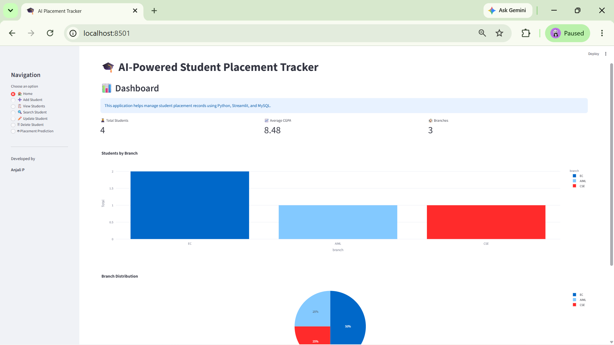
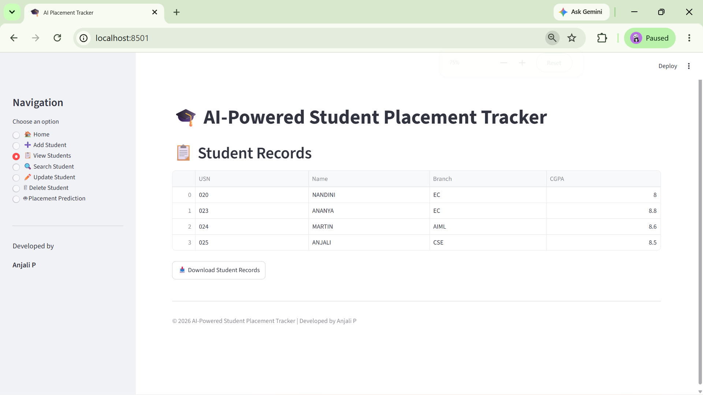
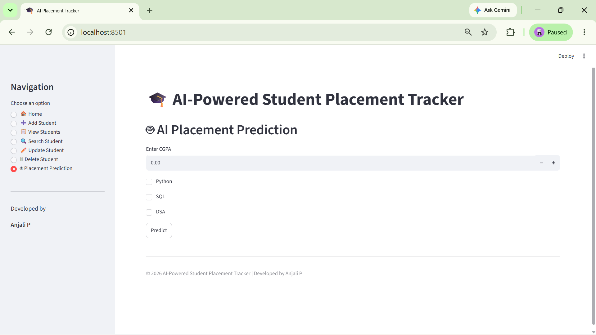

# 🎓 AI-Powered Student Placement Tracker

## 📌 Description

AI-Powered Student Placement Tracker is a web-based application built using **Python, Streamlit, and MySQL**. It helps manage student placement records through an interactive dashboard, supports complete CRUD operations, provides analytics, and includes a rule-based placement prediction feature.

---

## 🚀 Demo

Run the application locally:

```bash
python -m streamlit run streamlit_app.py
```

---

## 🖥 Current Interface

The project was initially developed as a Python terminal application (`app.py`) to learn CRUD operations and database integration.

The current version is a **Streamlit Web Application**, and the main entry point is:

```bash
python -m streamlit run streamlit_app.py
```

---

## ✨ Features

- ✅ Add Student
- ✅ View Students
- ✅ Search Student
- ✅ Update Student
- ✅ Delete Student
- ✅ Dashboard Analytics
- ✅ Interactive Bar Chart
- ✅ Interactive Pie Chart
- ✅ Rule-Based Placement Prediction
- ✅ Export Student Records as CSV

---

## 🌟 Project Highlights

- 🎯 Interactive Streamlit Dashboard
- 🗄️ MySQL Database Integration
- 🔄 Complete CRUD Operations
- 🤖 Rule-Based Placement Prediction
- 📊 Student Analytics Dashboard
- 📈 Data Visualization using Plotly
- 📥 CSV Export Functionality
- 📂 Modular Python Project Structure

---

## 🛠️ Technologies Used

- Python
- Streamlit
- MySQL
- Pandas
- Plotly
- Git
- GitHub
- VS Code

---

## ▶️ How to Run

### 1. Clone the repository

```bash
git clone https://github.com/Anjalip2/AI-Placement-Tracker.git
```

### 2. Navigate to the project

```bash
cd AI-Placement-Tracker
```

### 3. Install dependencies

```bash
pip install -r requirements.txt
```

### 4. Run the application

```bash
python -m streamlit run streamlit_app.py
```

---

## 📂 Project Structure

```text
AI-Placement-Tracker/
│
├── assets/
│   ├── dashboard.png
│   ├── students.png
│   └── prediction.png
│
├── modules/
│   ├── database.py
│   ├── student.py
│   ├── validation.py
│   └── menu.py
│
├── app.py
├── streamlit_app.py
├── README.md
├── requirements.txt
└── .gitignore
```

---

## 📸 Screenshots

### 🏠 Dashboard

*(Add `assets/dashboard.png` here)*

```markdown

```

### 📋 Student Records

```markdown

```

### 🤖 Placement Prediction

```markdown

```

---

## 🚀 Future Enhancements

- 🔐 Login Authentication
- 🤖 Machine Learning-based Placement Prediction
- 📧 Email Notifications
- ☁️ Cloud Deployment
- 👤 Student Profile Photos
- 📱 Responsive Mobile Layout

---

## 👩‍💻 Author

**Anjali P**

- GitHub: https://github.com/Anjalip2

---

## 📄 License

This project was developed for learning, academic, and placement preparation purposes.